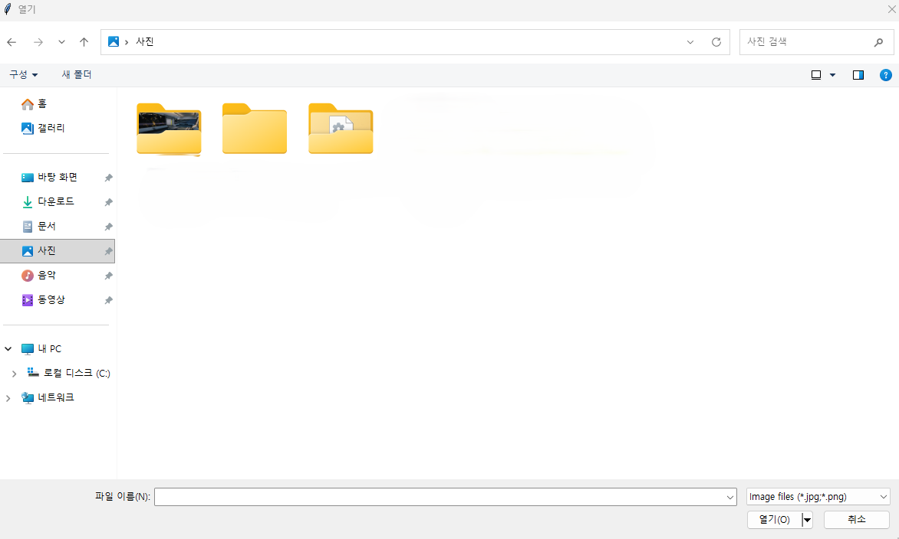
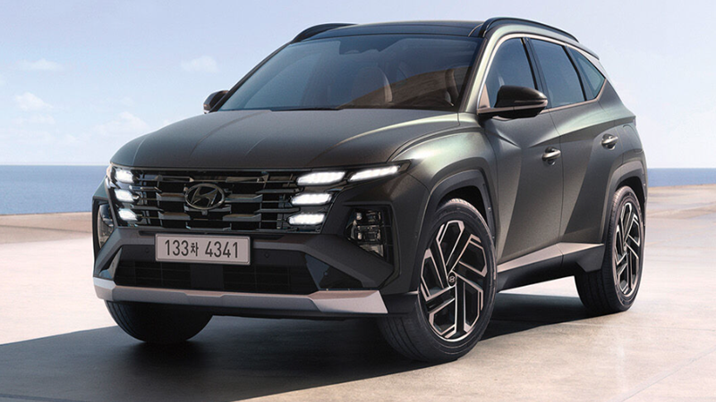
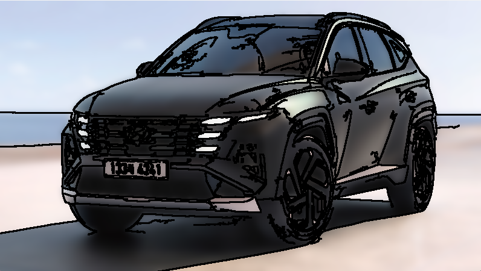
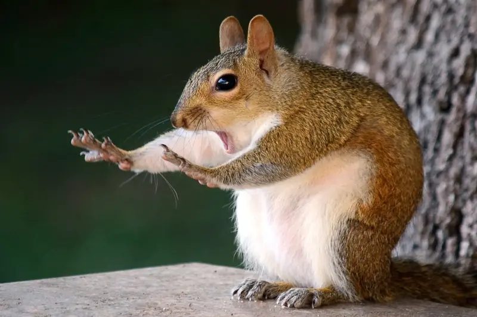
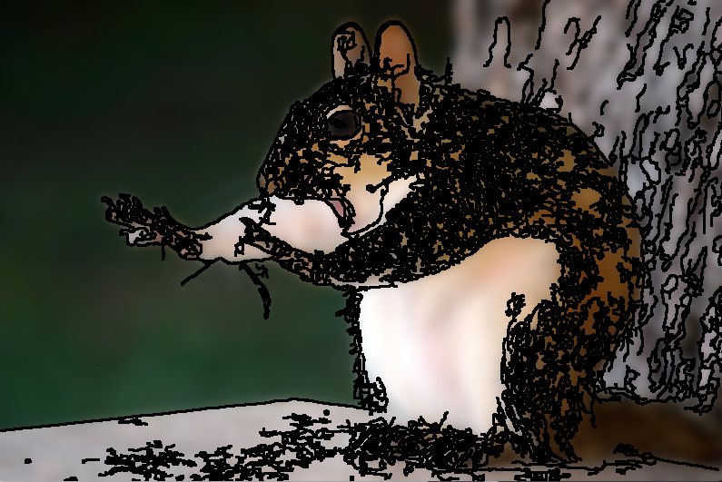

# pictureToCartoon
openCV를 사용한 사진을 카툰풍으로 바꾸는 프로그램

---
## 주요 기능
* 실행 후 사진을 선택
<table>
  <tr>
    <td></td>
    </tr>
</table>

* 선택한 사진을 카툰풍으로 변환
<table>
  <tr>
    <td></td>
    <td></td>
    </tr>
</table>

---
## 한계
* 털이나 이목구비 같은 복잡한 표현을 잘 구현하지 못함
* 검은색 비율이 많은 사진을 투입할 경우 외곽선이 검은색이므로 큰 효과를 얻지 못함
* 아래 사진과 같이 검은 점들이 많이 분포한 사진일 경우 외곽선이 매우 많아짐
<table>
  <tr>
    <td></td>
    <td></td>
    </tr>
</table>